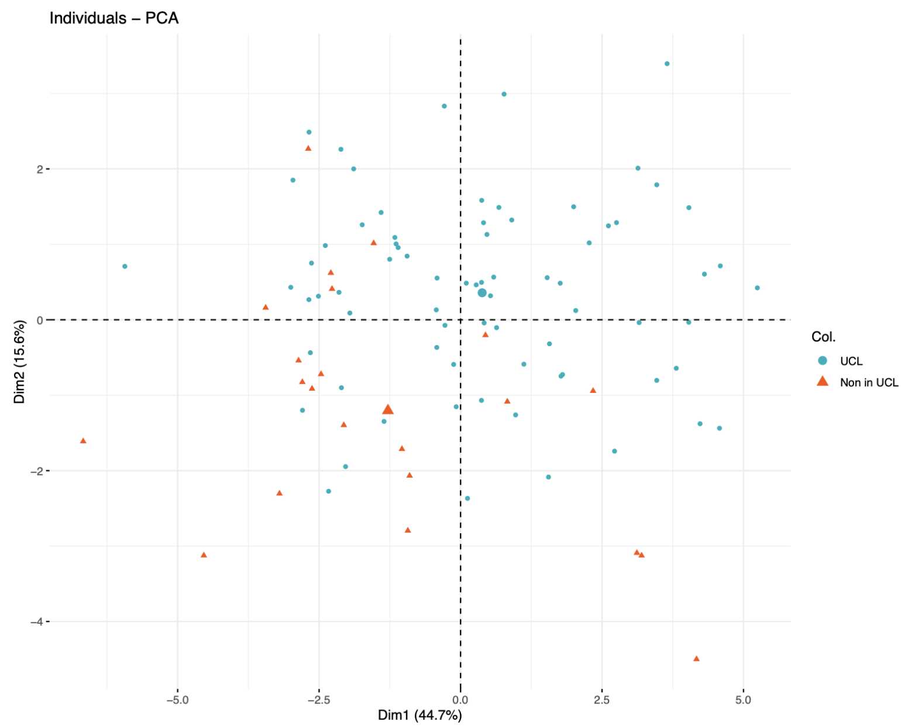
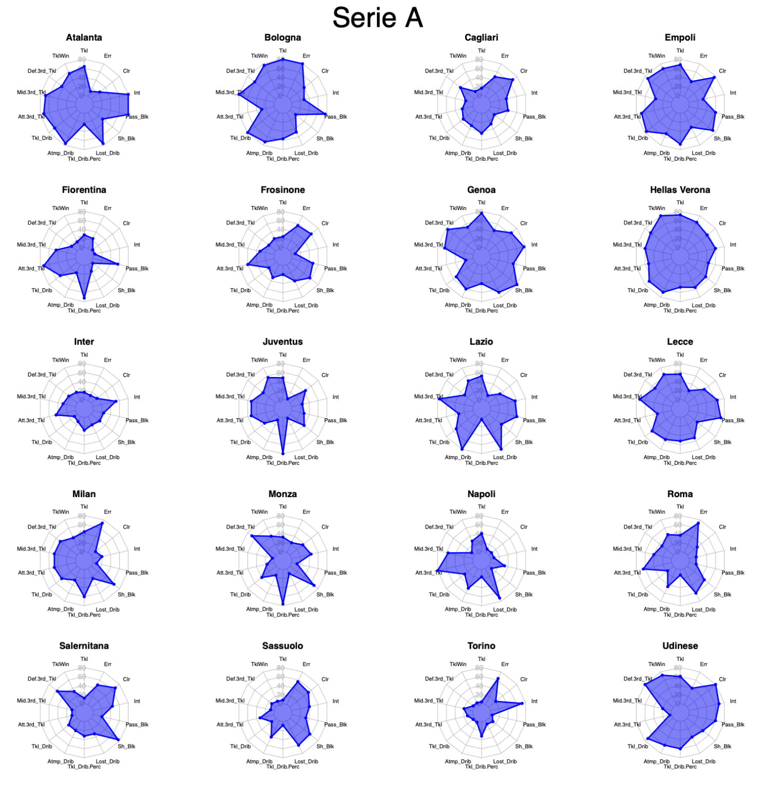

# Application of PCA & Multiple Linear Regression with football data
# DefensivePerformance_PCA

**Defensive Performance Analysis of Top 5 European Leagues — 2023/24 Season**

A statistical analysis of team-level defensive data from the five major European football leagues (Serie A, Bundesliga, Ligue 1, La Liga, Premier League) in the 2023/24 season, applying **Principal Component Analysis (PCA)** and **Multiple Linear Regression**.

---

## 📋 Overview

This project explores *how* and *how much* top European clubs defend, going beyond simple tallies to identify:

- **Tactical profiles** of individual teams through descriptive statistics and radar charts.
- **Latent defensive dimensions** via PCA (e.g., overall defensive intensity, pressing orientation, midfield efficiency, error propensity).
- **Linear drivers of tackle success** via multiple regression with backward variable selection.

---

## 🖼️ Visuals

### PCA Biplot — UCL vs Non-UCL Teams


> Most Champions League qualifiers cluster in the positive PC1–PC2 region, suggesting that top clubs tend to be more active defensively — pressing higher and winning more tackles across all zones of the pitch.

### Radar Chart Example


> Each team's defensive profile expressed as percentile ranks across all 14 variables.

---

## 📂 Repository Structure

```
DefensivePerformance_PCA/
├── report.Rmd          # Main analysis document (R Markdown)
├── report.pdf          # Compiled PDF report
├── R/
│   └── helpers.R       # Reusable utility functions
├── data/
│   └── README.md       # Notes on data provenance and caching
├── output/
│   └── figures/
│       ├── pca_biplot_ucl.png     # PCA biplot — UCL vs non-UCL teams
│       └── radar_example.png      # Radar chart example
└── docs/
    └── variable_glossary.md   # Full variable descriptions
```

---

## 📦 Dependencies

All analysis is done in **R**. Install required packages with:

```r
install.packages(c(
  "tidyverse", "corrplot", "factoextra", "worldfootballR",
  "ggplot2", "GGally", "car", "lmtest", "PerformanceAnalytics",
  "gridExtra", "fmsb", "psych", "scales"
))
```

> **Note:** `worldfootballR` scrapes data from [fbref.com](https://fbref.com). An active internet connection is required to reproduce the data-loading step. To avoid repeated scraping, the cleaned dataset can be cached locally — see [`data/README.md`](data/README.md).

---

## 🚀 Reproducing the Analysis

1. Clone the repository:
   ```bash
   git clone https://github.com/marinoalfonso/DefensivePerformance_PCA.git
   cd DefensivePerformance_PCA
   ```

2. Open `report.Rmd` in **RStudio** (or any R environment).

3. Install dependencies (see above).

4. Knit the document to PDF or HTML:
   ```r
   rmarkdown::render("report.Rmd", output_format = "pdf_document")
   # or
   rmarkdown::render("report.Rmd", output_format = "html_document")
   ```

---

## 🔑 Key Findings

| Stage | Main Result |
|---|---|
| Descriptive | Tottenham leads in attacking-third tackles; Juventus leads in dribble-countering %; Liverpool concedes most dribbles (Gegenpressing effect). |
| PCA | 4 PCs explain >75% variance. PC1 = overall defensive intensity; PC2 = pressing height; PC3 = midfield efficiency; PC4 = error propensity. |
| Regression | Best model for `TklWin`: tackles in all three field zones (positive) + shots blocked (negative). Adjusted R² > 0.90 after backward selection. |

---

## 📊 Data Source

Data extracted via the [`worldfootballR`](https://jaseziv.github.io/worldfootballR/) R package from [fbref.com](https://fbref.com), a widely used football statistics aggregator. The dataset covers **96 teams** (20 per league, 18 for Bundesliga and Ligue 1) with **14 numeric defensive variables** per team.

---

## 👤 Author

**Alfonso Marino**  
[GitHub](https://github.com/marinoalfonso) · Feel free to open an issue or submit a PR.

---

## 📄 License

This project is licensed under the [MIT License](LICENSE).r the [MIT License](LICENSE).
